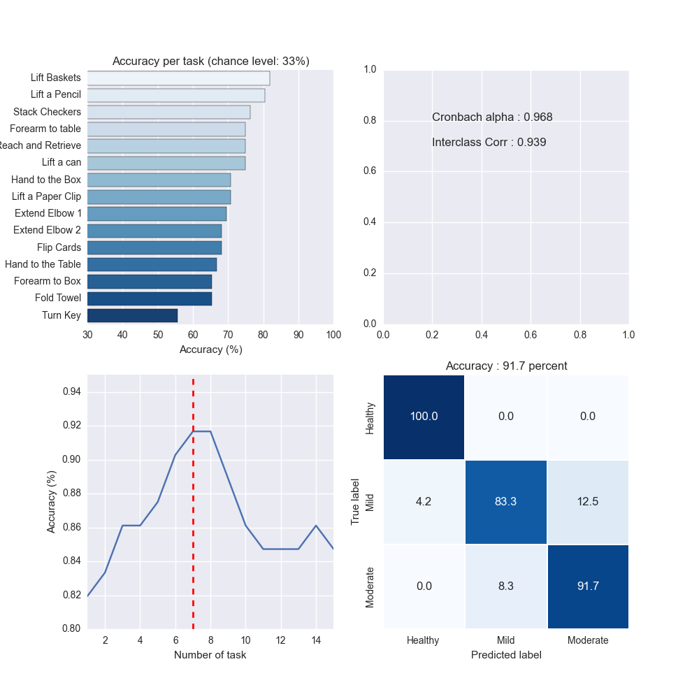
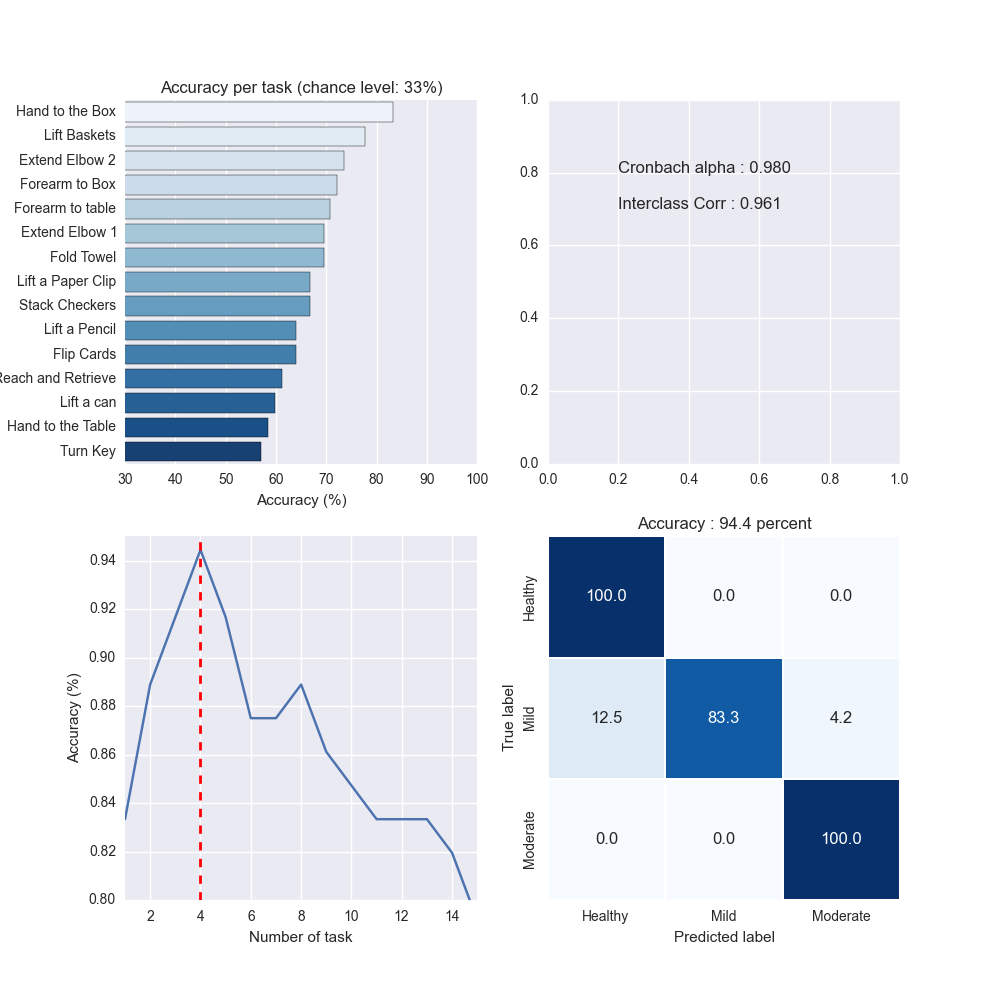
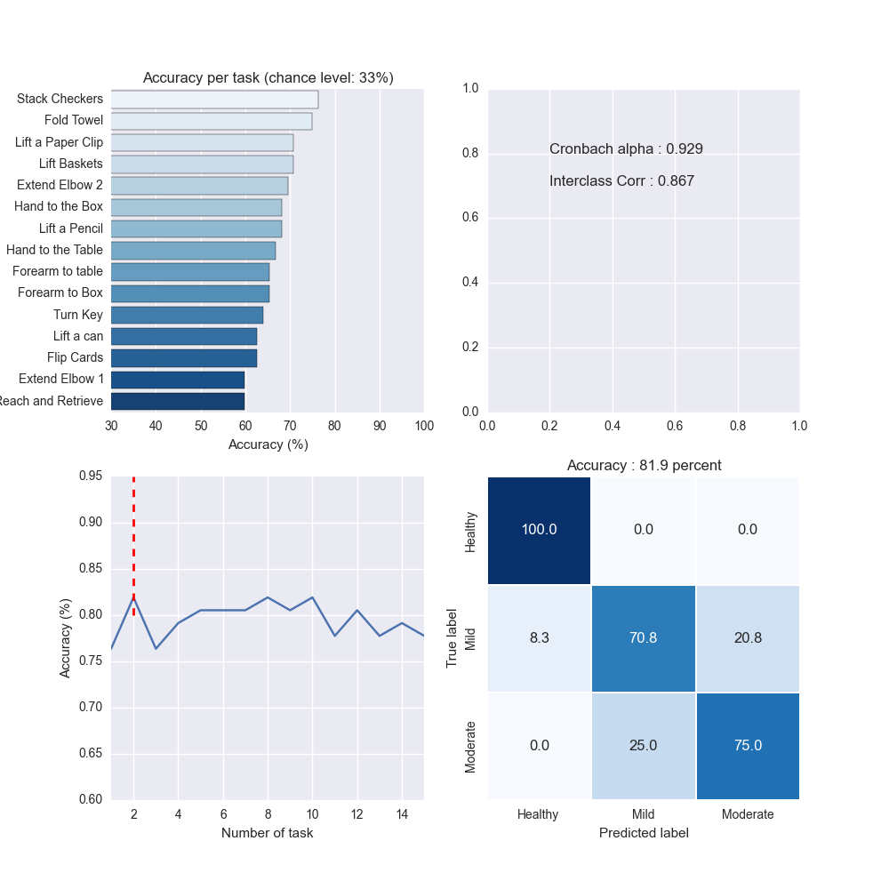

# WMFT_JBHI
Code and data for the paper [**Using data from the Microsoft Kinect 2 to  quantify upper limb behavior: a feasibility study**](http://ieeexplore.ieee.org/document/7560607/?reload=true)

The data folder contain individual data for the 24 subjects of the study. Each subject performed 15 tasks of the modified WMFT under 3 conditions.

### SVM results

Results obtained by using a SVM classifier

### Logistic Regression results

Results obtained by using a Logistic Regression

### MDM results

Results obtained by using a Riemannian MDM classifier (based on distance only)

